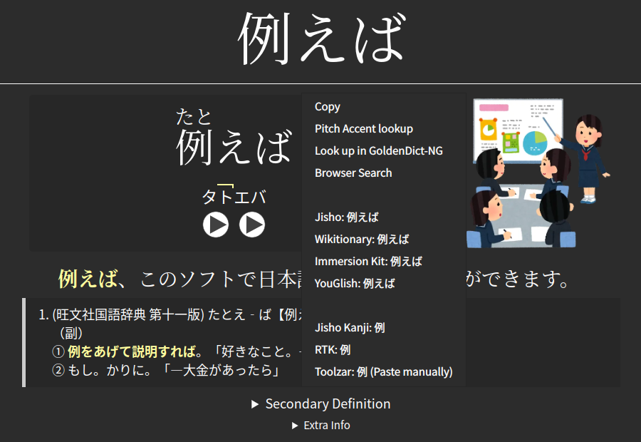

# Japanese Multisearch

Quickly look up your current card (or highlighted selection) through various resources in the context menu (right click).

# Installation

On Anki: Tools->Add-ons->Get Add-ons. Paste the following code.
>1836088313

